# Sketches de Interfaces

Aquí se presentan los 12 bocetos de las interfaces en una tabla organizada.

| #  | Nombre de la Interfaz      | Vista Previa |
|----|----------------------------|-------------|
| 1  | Home de Gerencia       |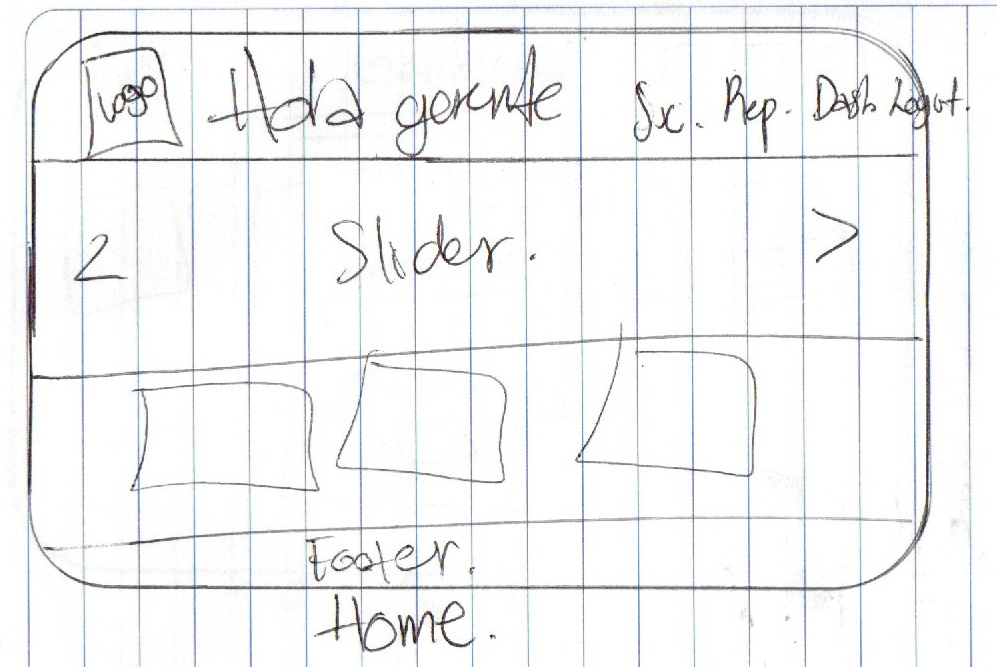 |
| 2  | Registro usuario | 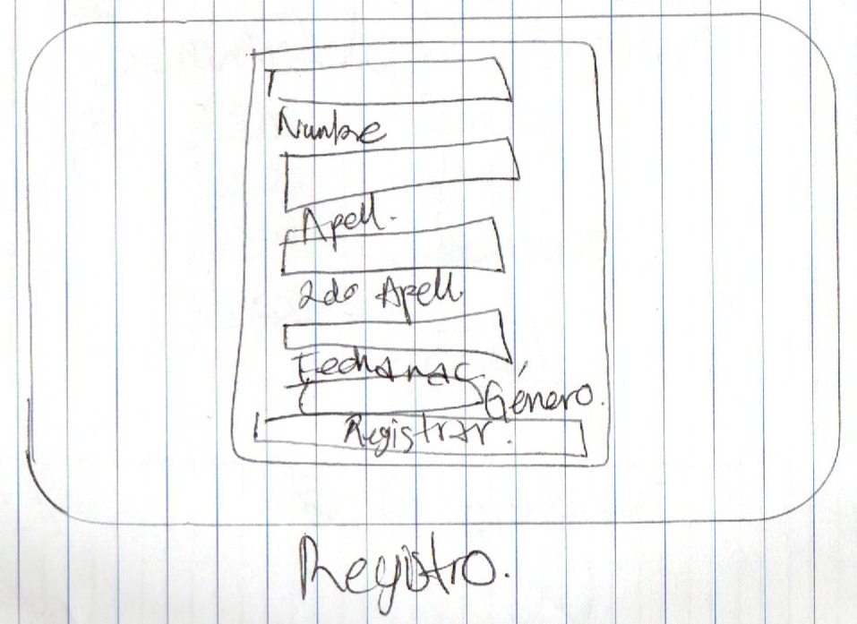  |
| 3  | Login usuario |   |
| 4  | Dashboard  | 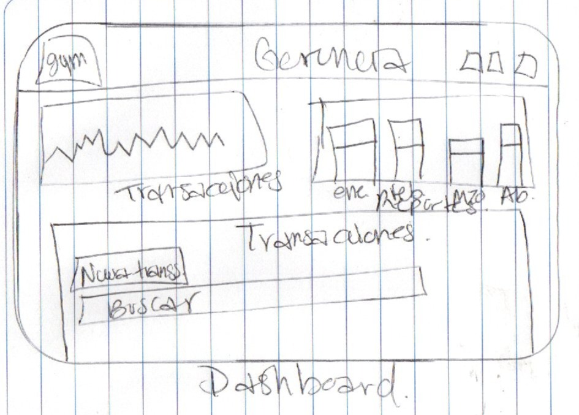  |
| 5  | Tabla transacciones  | 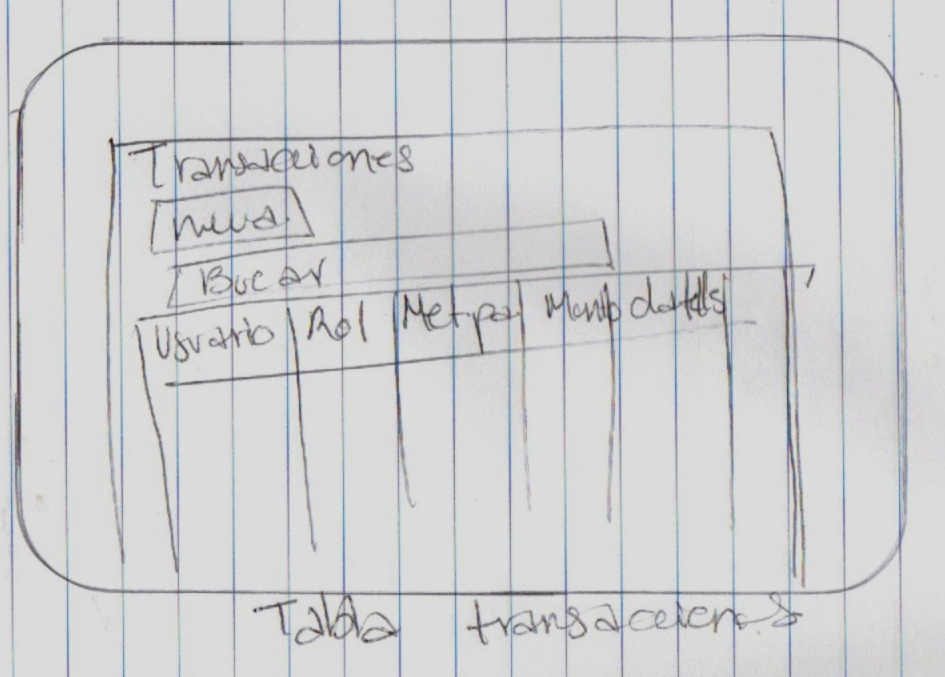  |
| 6  | Registrar transacción  | 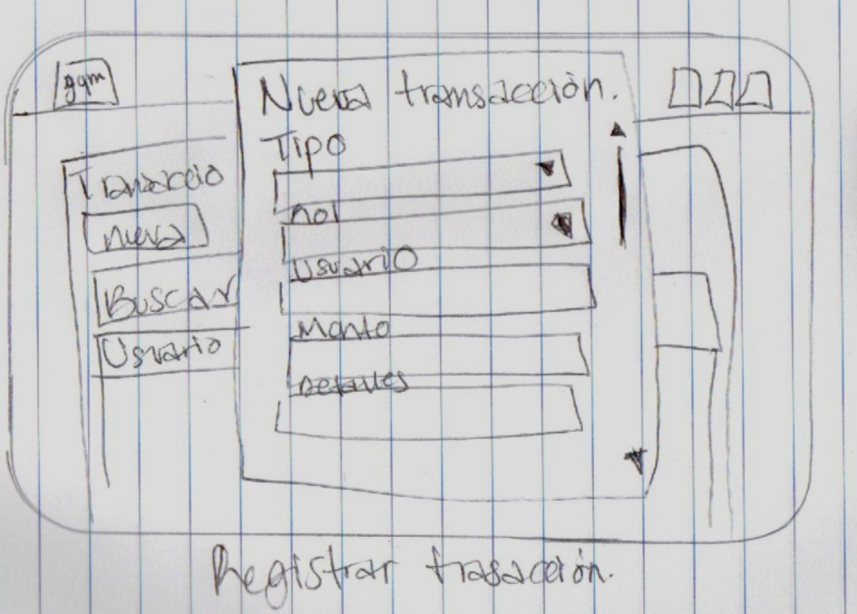  |
| 7  | Tabla reportes  | 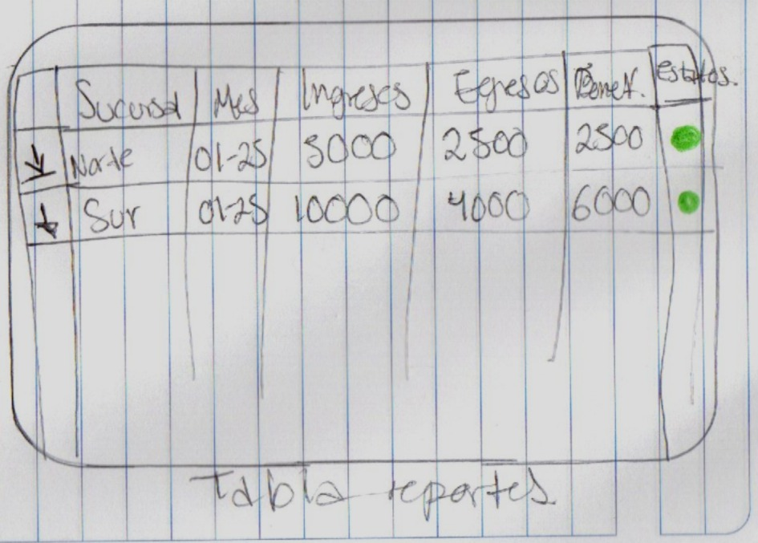  |
| 8  | Sucursales  | 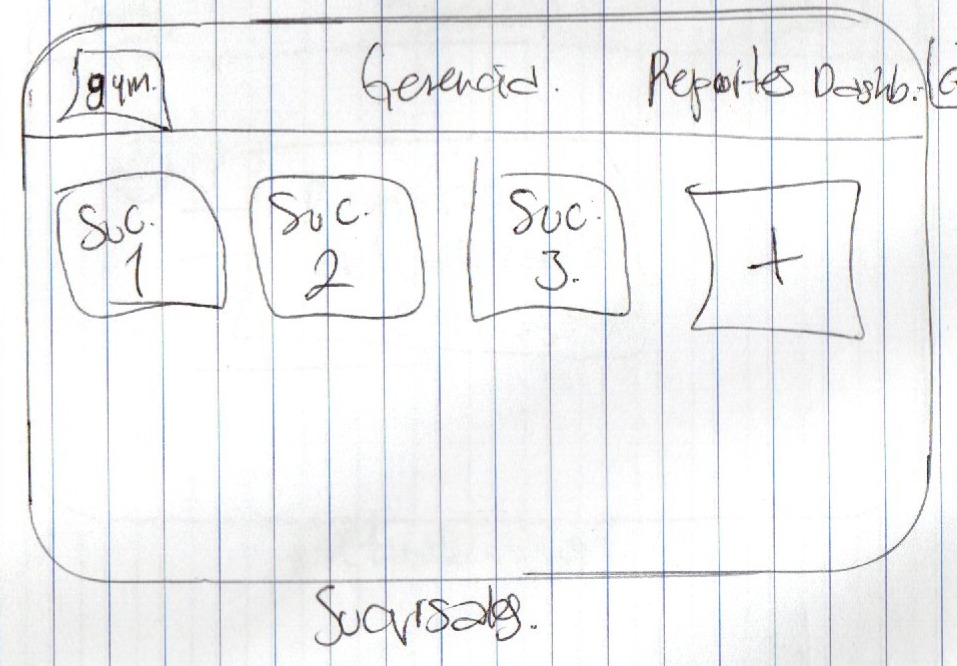  |
| 9  | Registro sucursal  | 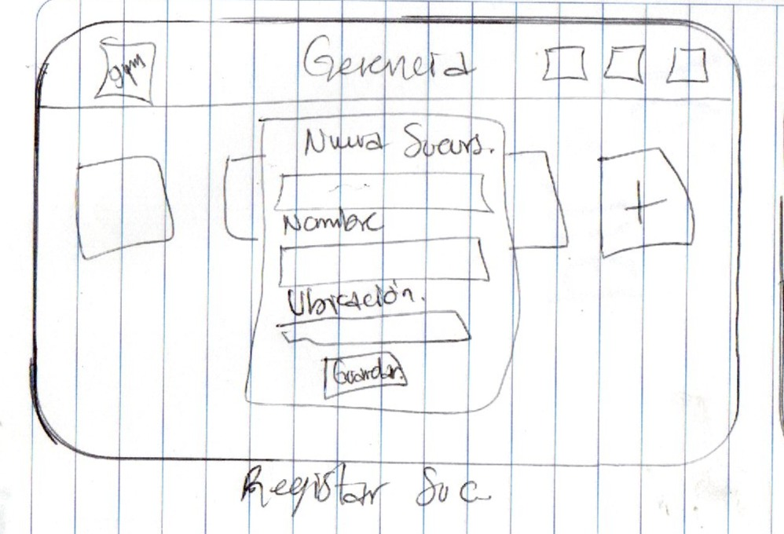  |
| 10  | Ver sucursal  | 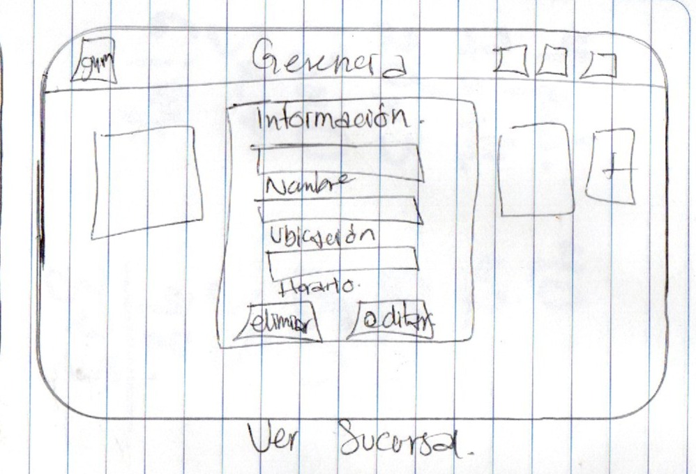  |
| 11  | Perfil gerente  | 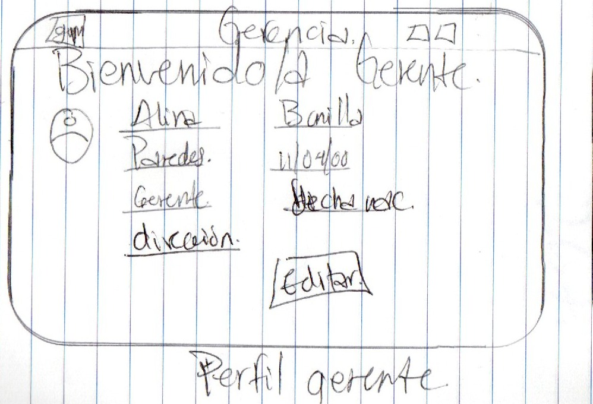  |
| 12  | Registro  | 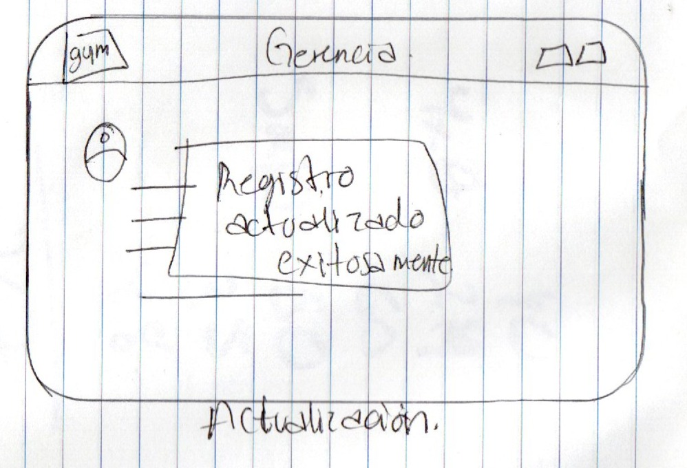  |

> [!IMPORTANT]  
> Estos sketches representan ideas preliminares antes de los wireframes y mockups. Pueden no ser idénticos a la versión final del sitio web.

