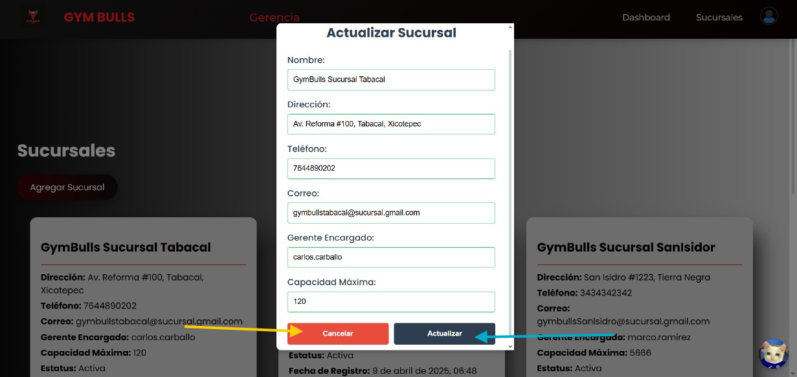

# Manual de Usuario - Sistema Web

Este manual tiene como objetivo guiar al usuario en el uso del sistema web, proporcionando una descripción paso a paso de las principales funcionalidades, acompañadas de capturas de pantalla para facilitar su comprensión. A continuación, se presenta una tabla con explicaciones detalladas y representaciones visuales de cada sección del sistema.

<table>
  <tr>
    <th>Descripción</th>
  </tr>

  <tr>
    <td>
      <strong>Landing Page</strong> 
      Pantalla principal que se muestra al acceder al sistema. Contiene un botón para iniciar sesión.
        
      
    </td>
  </tr>

  <tr>
    <td>
      <strong>Inicio de Sesión</strong> 
      Al hacer clic en el botón de la landing page, se accede a la pantalla de inicio de sesión, donde el usuario debe ingresar su nombre de usuario y contraseña para acceder al sistema.
        
      
    </td>
  </tr>

  <tr>
    <td>
      <strong>Home de Gerencia</strong> 
      Una vez iniciada la sesión, se muestra la pantalla principal para usuarios con rol de gerente. Desde aquí se puede navegar a las vistas de sucursales o acceder al dashboard.
        
      
        
      
    </td>
  </tr>

  <tr>
    <td>
      <strong>Gestión de Sucursales</strong> 
      En esta vista se pueden registrar, editar o eliminar sucursales, así como visualizar la información de las ya registradas.
        
      
        
      
        
      
    </td>
  </tr>

  <tr>
    <td>
      <strong>Perfil del Usuario</strong> 
      Vista donde los usuarios con rol de gerente pueden visualizar y editar su información personal.
        
      
        
      
    </td>
  </tr>

  <tr>
    <td>
      <strong>Opciones del Menú de Perfil</strong> 
      Al hacer clic sobre el ícono de perfil, se despliega un menú con opciones para acceder a la vista del perfil o cerrar sesión.
        
      
    </td>
  </tr>

  <tr>
    <td>
      <strong>Dashboard</strong> 
      Vista desde la cual los gerentes pueden consultar gráficas y tablas relacionadas con las transacciones realizadas. También permite agregar nuevas transacciones.
        
      
        
      
    </td>
  </tr>
</table>
