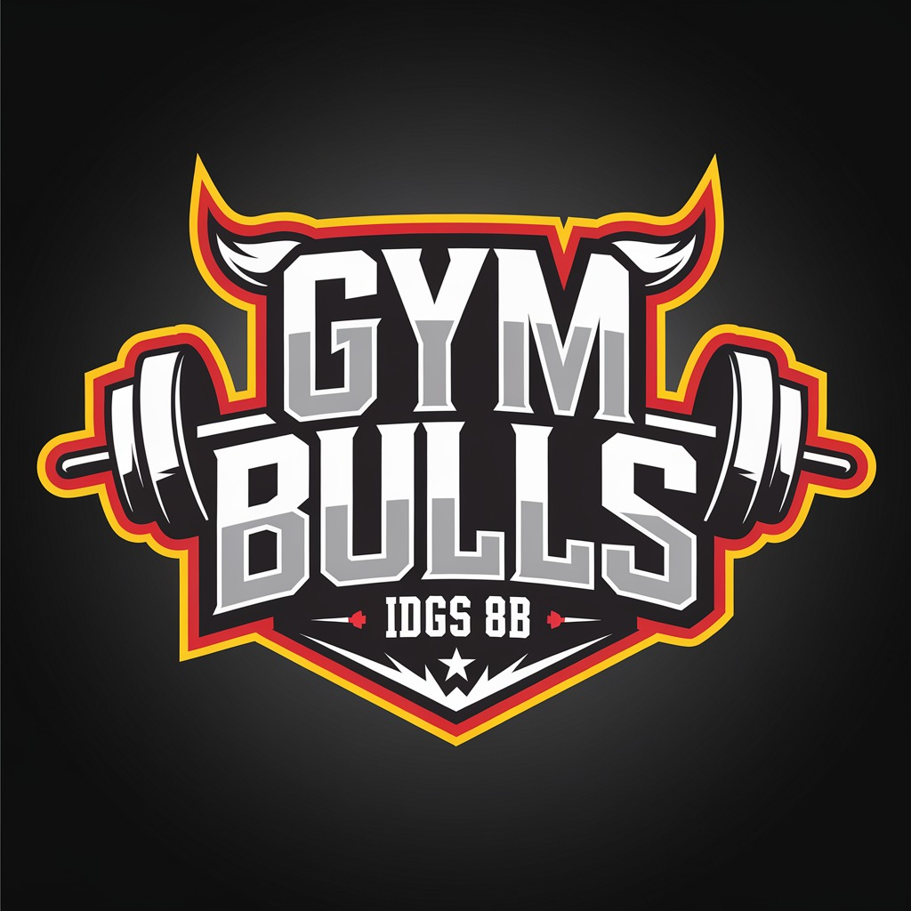
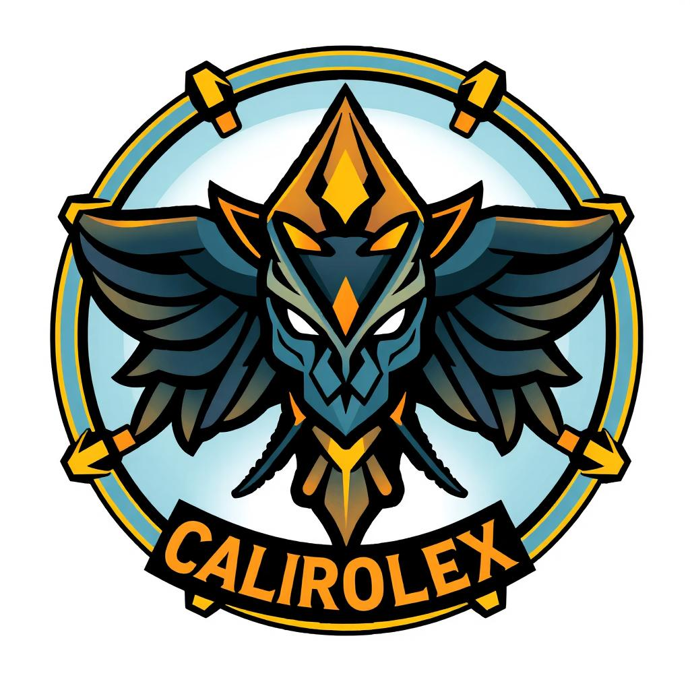
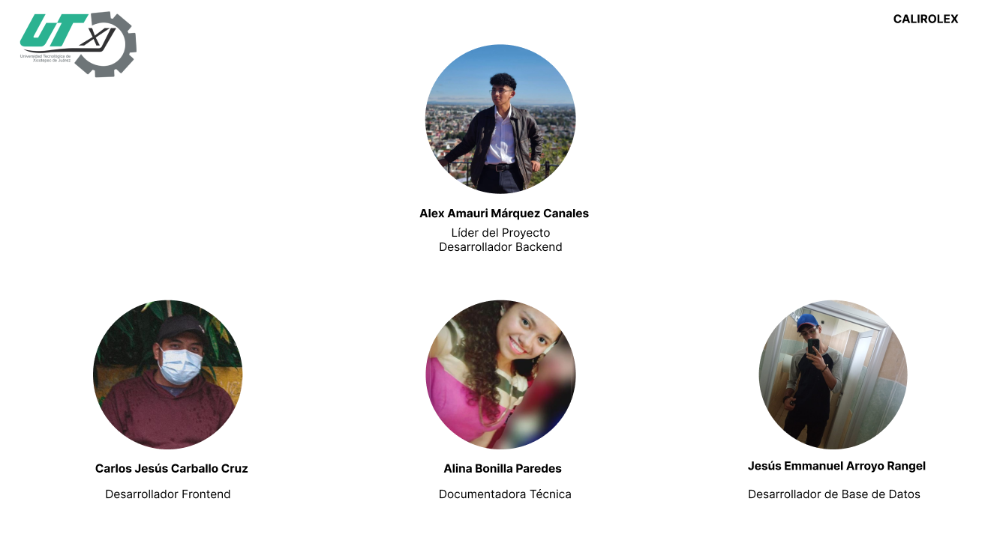
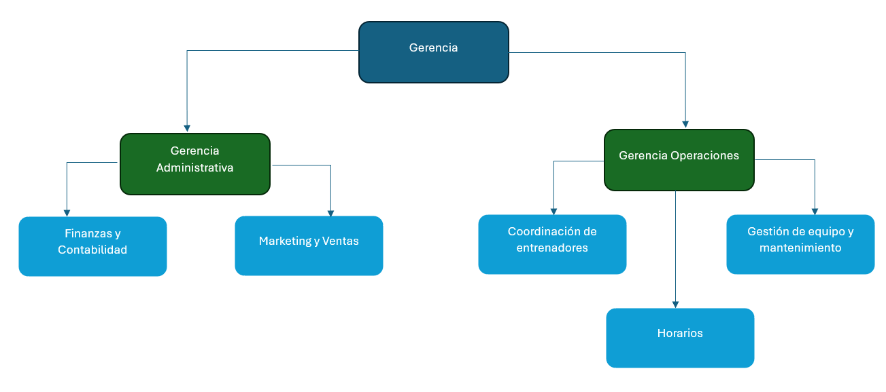
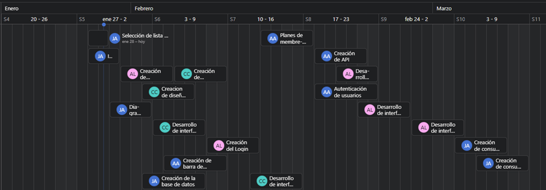

# TI-8B-Calirolex-Gerencia

<table>
  <tr>
    <td style="text-align: center;">
       
      <strong>Logo Gimnasio</strong>
    </td>
    <td style="text-align: center;">
       
      <strong>Logo de Equipo</strong>
    </td>
  </tr>
</table>

  
  
<strong>Organigrama del Equipo</strong>

<h3>Colaboradores</h3>

<table style="width: 100%; border-collapse: collapse; margin-top: 30px;">
  <thead>
    <tr>
      <th style="border: 1px solid #ddd; padding: 8px; text-align: center;">Colaborador</th>
      <th style="border: 1px solid #ddd; padding: 8px; text-align: center;">Perfil</th>
      <th style="border: 1px solid #ddd; padding: 8px; text-align: center;">Contribuciones</th>
    </tr>
  </thead>
  <tbody>
  <tr>
      <td style="border: 1px solid #ddd; padding: 8px; text-align: center;">Alex Amauri Marquez Canales</td>
      <td style="border: 1px solid #ddd; padding: 8px; text-align: center;"><a href="https://github.com/Alex01Dev" target="_blank">Perfil Amauri</a></td>
      <td style="border: 1px solid #ddd; padding: 8px; text-align: center;">Lider del Proyecto, Desarrollador Backend</td>
    </tr>
    <tr>
      <td style="border: 1px solid #ddd; padding: 8px; text-align: center;">Alina Bonilla Paredes</td>
      <td style="border: 1px solid #ddd; padding: 8px; text-align: center;"><a href="https://github.com/Ali-2121" target="_blank">Perfil Alina</a></td>
      <td style="border: 1px solid #ddd; padding: 8px; text-align: center;">Documentadora Tecnica</td>
    </tr>
    <tr>
      <td style="border: 1px solid #ddd; padding: 8px; text-align: center;">Carlos Jesus Carballo Cruz</td>
      <td style="border: 1px solid #ddd; padding: 8px; text-align: center;"><a href="https://github.com/CarlosJ67" target="_blank">Perfil Carballo</a></td>
      <td style="border: 1px solid #ddd; padding: 8px; text-align: center;">Desarrollador Frontend</td>
    </tr>
    <tr>
      <td style="border: 1px solid #ddd; padding: 8px; text-align: center;">Jesus Emmanuel Arroyo Rangel</td>
      <td style="border: 1px solid #ddd; padding: 8px; text-align: center;"><a href="https://github.com/des-arrosho" target="_blank">Perfil Arroyo</a></td>
      <td style="border: 1px solid #ddd; padding: 8px; text-align: center;">Desarrollo de Base de Datos</td>
    </tr>
  </tbody>
</table>

# 🏋️‍♂️ Contexto de Negocio - Bulls Gym
Bulls Gym es un centro de entrenamiento de alto rendimiento enfocado en brindar a sus miembros una experiencia única para alcanzar sus objetivos de acondicionamiento físico. Nuestro enfoque combina instalaciones de primer nivel, entrenadores certificados y una comunidad motivadora que impulsa el progreso de cada atleta.

- 🎯 **Misión**
Empoderar a nuestros miembros para que alcancen su máximo potencial físico y mental a través de entrenamiento de calidad, tecnología innovadora y un ambiente de apoyo.

- 👊 **Visión**
Ser el gimnasio líder en la comunidad, reconocido por transformar vidas mediante el fitness, la disciplina y la constancia.

- 💡 **Valores**
  - Disciplina – Creemos en la constancia como clave del éxito.
  - Fuerza – No solo física, sino también mental y emocional.
  - Comunidad – Fomentamos un ambiente de apoyo y motivación.
  - Innovación – Utilizamos tecnología y metodologías avanzadas para optimizar el rendimiento.

- 🏆 **Diferenciadores**
  - Entrenadores especializados en diversas disciplinas (fuerza, resistencia, funcional, HIIT, etc.).
  - Equipamiento de última generación para maximizar el rendimiento.
  - Programas personalizados según objetivos individuales.
  - Clases grupales y entrenamiento personalizado.
  - Aplicación móvil para seguimiento de progreso y reservas.

Bulls Gym no es solo un gimnasio, es una filosofía de vida donde cada repetición, cada gota de sudor y cada desafío superado nos acerca a la mejor versión de nosotros mismos.

🔥 ¡Únete a la manada y rompe tus límites! 🔥

## Organigrama del GYM

## Planteamiento del Problema
En la actualidad, los gimnasios con múltiples sucursales enfrentan el reto de administrar eficientemente sus operaciones diarias, desde la gestión de clases y mantenimiento de equipos hasta la implementación de promociones y seguimiento de clientes. La falta de un sistema web centralizado ha generado múltiples inconvenientes que afectan la calidad del servicio y la eficiencia operativa

Actualmente, la administración de clases, promociones y mantenimiento se realiza de manera manual, utilizando hojas de cálculo, llamadas telefónicas y comunicación a través de aplicaciones de mensajería. Esto ha derivado en problemas como la falta de control en la programación de clases, errores en la asignación de mantenimiento y demoras en la implementación de promociones. Además, la ausencia de un sistema automatizado impide que los gerentes tengan una visión clara y en tiempo real de las operaciones en cada sucursal, lo que dificulta la toma de decisiones informadas.

Dado este contexto, es necesario implementar un sistema web centralizado que permita a la gerencia del gimnasio gestionar de manera eficiente las clases, el mantenimiento, las promociones y el seguimiento de clientes en todas sus sucursales. Este sistema mejorará la organización, optimizará la comunicación interna y garantizará una mejor experiencia para los usuarios.

---

## ✅ Propuesta de Solución
Para enfrentar los desafíos operativos de un gimnasio con múltiples sucursales, proponemos el diseño e implementación de un sistema web centralizado que aborde las necesidades de organización, control y comunicación identificadas en el planteamiento del problema. Este sistema permitirá automatizar procesos, centralizar la información y proporcionar herramientas para la gestión eficiente de las operaciones en tiempo real.

El sistema estará compuesto por cinco módulos principales: **Gerencia, Recursos Humanos, Recursos Materiales, Training (entrenamiento) y Servicios al Cliente**. Cada módulo tendrá funcionalidades específicas diseñadas para mejorar la administración general del gimnasio, optimizar la interacción entre sucursales y ofrecer una experiencia superior a los usuarios finales.

### 1. Módulo de Gerencia
El módulo de gerencia será el corazón del sistema, permitiendo la supervisión y gestión global de todas las sucursales. Incluirá un panel de control centralizado, indicadores clave de desempeño, reportes para el análisis permitiendo una toma de decisiones informadas. Este módulo facilitará la planificación de campañas promocionales, el monitoreo de operaciones y la gestión de incidencias de mantenimiento.

## 🎯 Objetivo General
Desarrollar una plataforma digital integral para la gestión de la información operativa de un gimnasio, que permita administrar de manera eficiente los datos de los miembros, el seguimiento de entrenamientos, el control de pagos, las reservas de clases y otros procesos administrativos, mejorando así la eficiencia operativa y la experiencia del usuario.

## ✅ Objetivos Específicos
Aquí tienes los objetivos específicos desglosados en seis puntos:  

1. **Visualizar los datos del gimnasio en gráficos diarios**, incluyendo la cantidad de membresías adquiridas, usuarios por sucursal y número total de clientes.  
2. **Generar reportes mensuales detallados**, permitiendo analizar tendencias en membresías, clientes y actividad por sucursal.  
3. **Monitorear el rendimiento de cada sucursal**, evaluando el flujo de clientes y la evolución de las membresías activas.  
4. **Facilitar la gestión centralizada de la información de las sucursales**, asegurando un acceso rápido y organizado a los datos clave.  
5. **Automatizar la recopilación y análisis de datos**, reduciendo el tiempo y esfuerzo necesario para evaluar el estado del gimnasio.  
6. **Optimizar la toma de decisiones** mediante información clara y estructurada sobre el desempeño general del gimnasio y sus sucursales.

## Diagrama de Gantt

## Lista de tecnologías

### Frontend

### Backend

### Base de Datos

  
 

### Diseño

### Documentación

